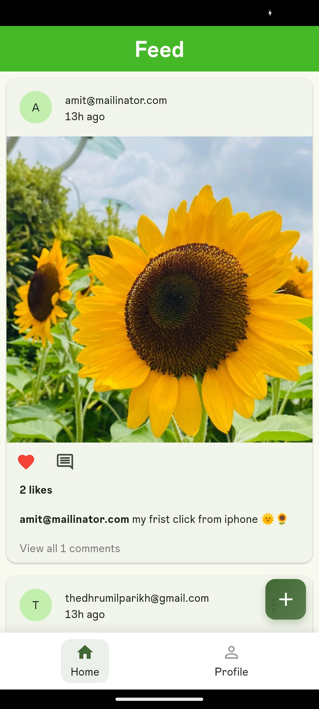
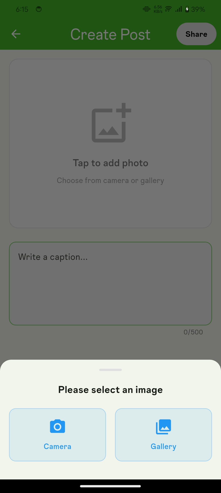
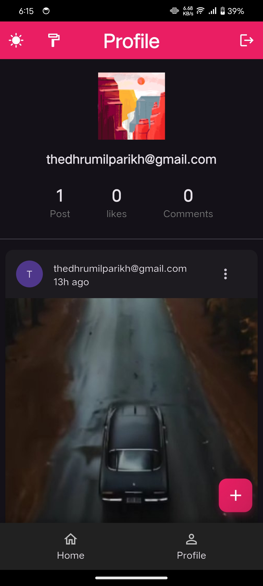
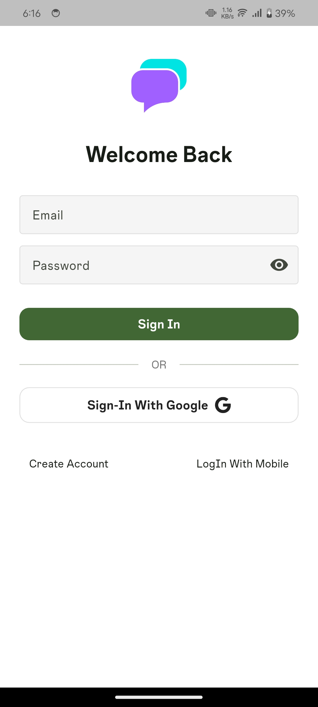
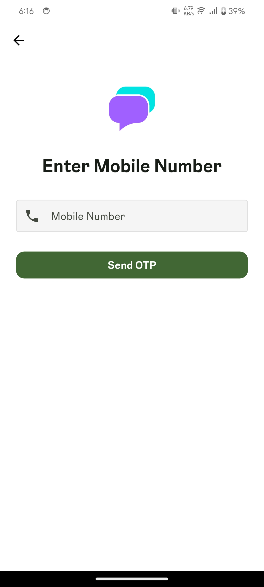
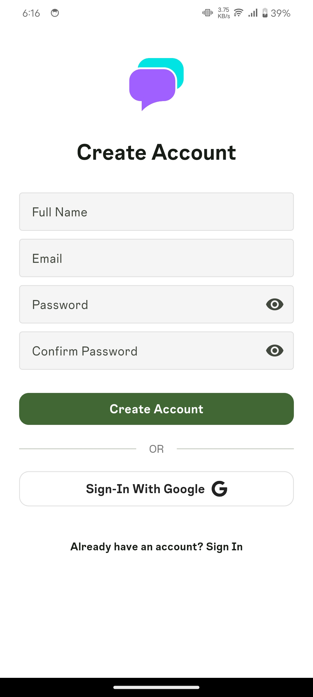

# Feed App

A feed application built with Flutter, implementing modern architectural patterns and user interaction features.

## Core Functionality

**Authentication**
- Google Sign-In
- Email & Password Authentication
- Phone Number Authentication (see known issues)
- Apple Sign-In (requires Apple Developer account for testing)

**Feed Management**
- Create, edit, and delete posts with images and captions
- Cloud storage integration for images
- Scrollable feed
- Real-time like and comment counts

**Social Features**
- Like with real-time updates
- Comment with user attribution

**Additional Features**
- Dark theme and multi-color theming support
- Offline caching

## Tech Stack

**Architecture**
- Clean Architecture
- Flutter BLoC for state management
  
**Database & Storage**
- Firebase Firestore for posts, comments, and user data
- Firebase Cloud Storage for media files
- Hive Database for local caching
- Firebase Authentication with multiple sign-in methods

## Project Setup

**Required**
- Flutter SDK (Channel stable, 3.32.8 or higher)
- Dart SDK
- Firebase project setup
- Android Studio / VS Code
- iOS development setup (for iOS builds)

**Installation**

1. Clone the repository
```bash
git clone https://github.com/Dhrumil02/social_feed_app.git
cd social-media-app
```

2. Install dependencies
```bash
flutter pub get
```

3. Firebase Configuration
   - Create a new Firebase project
   - Enable Authentication, Firestore, and Storage services
   - Add SHA fingerprints for authentication required for Authentication :

   Generate SHA-1 and SHA-256 fingerprints using keytool or Android Studio
   Add fingerprints to your Firebase project settings

   Setup Guideline : https://firebase.google.com/docs/flutter/setup

   - Download configuration files:
      - `google-services.json` for Android (place in `android/app/`)
      - `GoogleService-Info.plist` for iOS (place in `ios/Runner/`)

3. Run the application
```bash
flutter run
```

## Architecture Decisions

**State Management : BLoC **

The application uses the BLoC for state management for:
- Separation : clear differentiation between UI and business logic
- Easy testing of business logic
- Unidirectional data flow

**Data Storage Strategy**
- Remote Database: Firebase Firestore for real-time synchronization
- Local Database: Hive database for offline support
- Image Storage: Firebase Cloud Storage for scalable media handling

**Clean Architecture Implementation**
- Domain Layer: Contains business entities and use cases and implementation of repositories
- Data Layer: Handles data sources and repositories
- Presentation Layer: Manages UI and state presentation

## Known Issues

**Phone Authentication**
Phone number authentication implementation is complete but currently untested due to Firebase App Check integrity verification issues. This is a common issue in development environments.

**Apple Sign-In**
Apple Sign-In functionality is implemented but requires an active Apple Developer account for testing and production deployment.

## Status

**Completed**
- User authentication (Google, Email/Password)
- Post creation, editing, and deletion
- Feed listing
- Like and comment system
- Dark theme and multi-color theming
- Local caching with Hive
- Clean architecture implementation
- Basic CI/CD pipeline for build generation
- Widget test implementation

**In Progress**
- Phone authentication testing (known issue due to play integrity)
- Apple Sign-In testing (pending Apple Developer account)
- Source of Issue: https://docs.google.com/document/d/1nbUkaCzv2aw7aqzQjF10JRaXIiTr1aFKxtJnRt9gztg/edit?usp=sharing
- UI/UX enhancements
- Performance optimizations

## Download & Demo

**Download App**
- https://drive.google.com/file/d/14ZOqqj5GZOoI-UzovpgDFpyGy3YyBQ7-/view?usp=sharing - Download for Android devices

**Demo Video**
- https://drive.google.com/file/d/1YDYIjOIswInvowCJvl40F6kTFhxKnrge/view?usp=sharing

**Screenshots**
<div align="center">
  
  
  
  
</div>
<div align="center">
  
  
</div>
